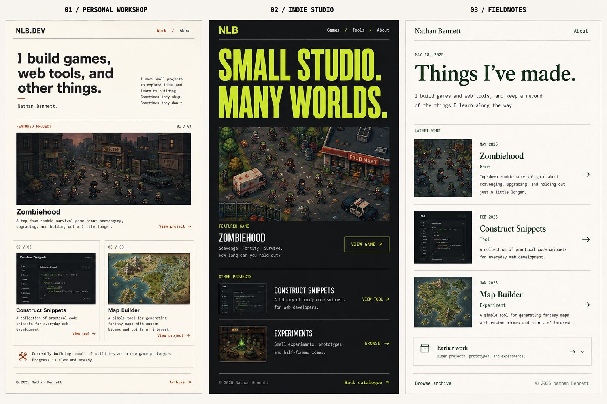
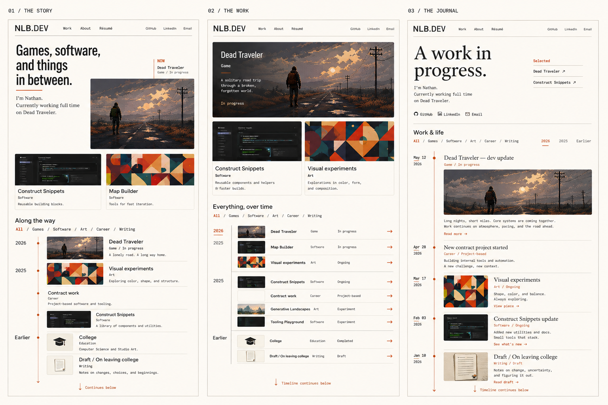
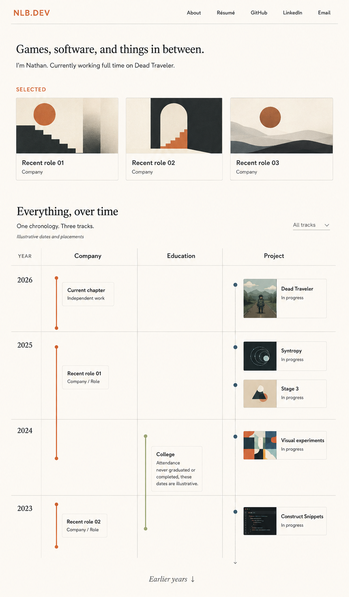
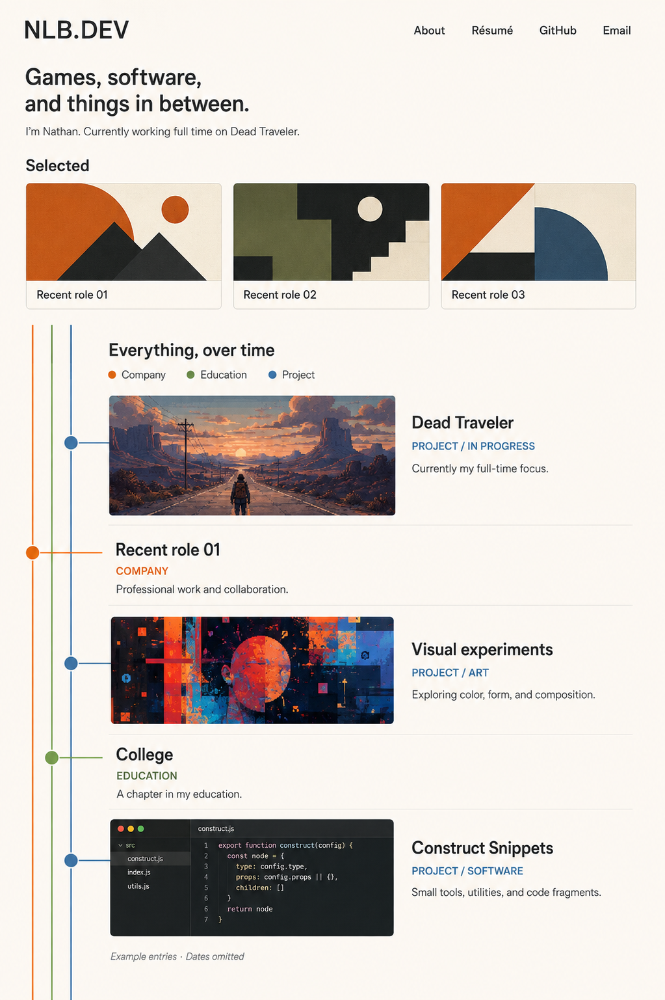

# Portfolio design concepts

All four images generated in [the original inspiration task](codex://threads/01a07f15-57e2-7a93-af7f-f3cacbbe2dd2), September 7–8, 2026. Preserved byte-for-byte; source filenames and SHA-256 checksums are recorded in `manifest.json`.

These are design references, not live-site assets. Do not import them into the app or move them into `static/`. The repository root `concepts/` directory is excluded from Vercel uploads and is not part of the SvelteKit public output.

## Initial three-direction comparison

## Refined three-direction comparison

## Single editorial portfolio concept

## Revised single full-width timeline concept

